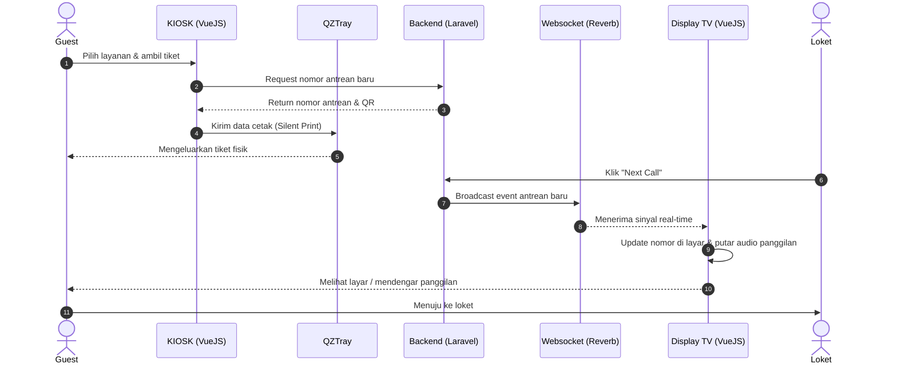
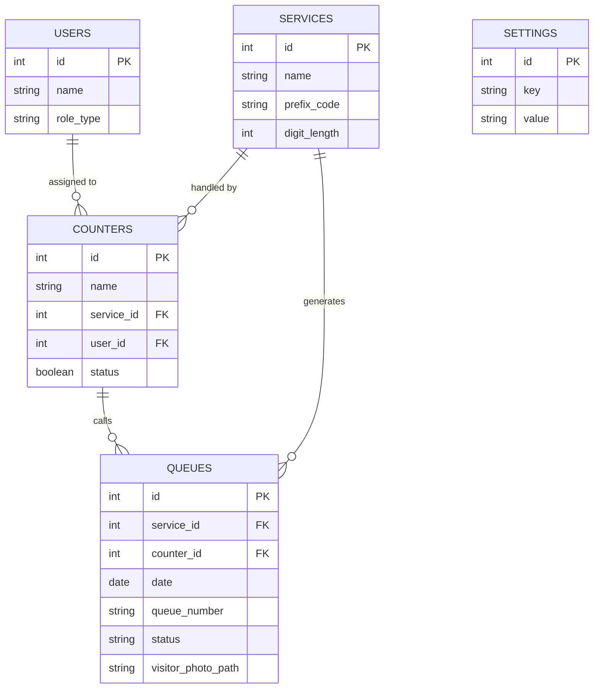

# PRD — Project Requirements Document

## 1. Overview
Dalam banyak pusat layanan, proses mengantre secara fisik seringkali menimbulkan penumpukan pengunjung, kebingungan antrean, dan ketidaknyamanan. Aplikasi Antrean Berbasis Web ini dirancang untuk mengatasi masalah tersebut dengan mendigitalisasi proses antrean mulai dari pengambilan nomor di KIOSK hingga pemanggilan di loket. 

Sistem ini memungkinkan pengunjung mengambil tiket cetak secara instan, memonitor sisa antrean secara *real-time* via ponsel genggam (menggunakan QR/Barcode), dan memberikan alat kontrol penuh bagi petugas loket maupun manajemen. Dengan arsitektur *Single Page Application* (SPA) dan sinkronisasi data yang cepat, aplikasi ini ditujukan untuk memberikan pengalaman antrean yang modern, cepat, dan transparan.

## 2. Requirements
- **Arsitektur Sistem:** Dibangun sebagai *Single Page Application* (SPA) untuk menjamin perpindahan halaman yang cepat dan tanpa jeda.
- **Komunikasi Real-Time:** Sistem harus menggunakan WebSockets untuk memperbarui layar tampilan antrean (Display) seketika saat petugas loket melakukan pemanggilan.
- **Direct Printing:** Sistem KIOSK harus terhubung langsung ke printer termal via metode QZTray agar tiket tercetak otomatis tanpa muncul jendela dialog *print* pada browser.
- **Logika Reset Harian:** Nomor antrean (misal: A001, B001) beserta datanya difilter berdasarkan hari ini dan secara otomatis ter-reset kembali ke urutan nomor satu (1) pada keesokan harinya.
- **Multi-Otoritas:** Pembagian hak akses yang ketat antara Superadmin (pengaturan dan analitik), Loket (operasional pemanggilan), dan Guest/Pengunjung (pengambilan tiket).

## 3. Core Features
Sistem memiliki beberapa modul utama berdasarkan penggunanya:

**Untuk Superadmin:**
- **Analitik & Dashboard:** Menampilkan grafik statistik jumlah pengunjung per layanan, serta histori dan index antrean harian.
- **Manajemen Modul:** Mengelola data Loket dan Layanan (termasuk *assign* layanan ke loket tertentu, penentuan kode prefiks layanan seperti "A" atau "B", dan jumlah digit angka antrean).
- **Pengaturan Global Aplikasi:** Fitur mengaktifkan/menonaktifkan kamera web pada KIOSK (untuk menangkap wajah pengunjung saat mengambil tiket), pengaturan Nama & Logo aplikasi, serta *generate* & *export* sertifikat QZTray dengan masa kedaluwarsa 100 tahun.

**Untuk Petugas Loket:**
- **Dashboard Kontrol Panggilan:** Antarmuka untuk memanggil pengunjung dengan tombol aksi: *Next Call*, *Call* (panggil), *Recall* (panggil ulang untuk antrean terlewat), dan *Layani* (menyelesaikan proses layanan).
- **Riwayat Antrean:** Daftar riwayat pengunjung yang sudah dilayani hari ini dan hari-hari sebelumnya.

**Untuk Pengunjung (Guest) & Display Layar Utama:**
- **KIOSK (Pengambilan Tiket):** Halaman awal (Index) tempat pengunjung memilih layanan, sistem (opsional) memotret wajah, dan tiket otomatis keluar.
- **Layar Display Utama:** TV/Monitor yang menunjukkan jajaran loket aktif, nomor antrean yang sedang dipanggil saat itu, dilengkapi dengan notifikasi suara panggilan (terpicu oleh *broadcast* dari loket).
- **Pemantauan Online:** Terdapat QR Code/Barcode di tiap tiket kertas, yang jika dipindai akan membuka web pelacakan antrean *real-time* (menunjukkan status dan sisa orang dalam daftar tunggu).

## 4. User Flow
1. **Pengambilan Tiket:** Pengunjung datang ke KIOSK, memilih layanan yang diinginkan di layar.
2. **Kamera & Cetak:** Sistem memotret pengunjung (jika fitur kamera aktif), menghasilkan nomor antrean hari ini, dan QZTray seketika mencetak tiket fisik berisikan nomor antrean serta QR Code pelacakan.
3. **Menunggu:** Pengunjung duduk di ruang tunggu atau memindai QR code tiket untuk memantau sisa antrean dari HP mereka dari luar ruangan.
4. **Pemanggilan:** Petugas loket menekan tombol "Next Call" di dashboard-nya.
5. **Notifikasi Display:** Perintah dikirim via WebSocket. Layar TV mengubah nomor antrean pada loket tersebut dan memutar audio panggilan ("Nomor antrean A001, silakan menuju loket satu").
6. **Pelayanan:** Pengunjung maju ke loket. Petugas menekan "Layani". Jika pengunjung tidak datang, petugas dapat menekan "Recall" melalui histori di sisi kanan halaman.

## 5. Architecture
Sistem berpusat pada interaksi antara Frontend (VueJS), Backend (Laravel), sistem *hardware endpoint* (Printer via QZTray), serta layanan WebSocket (Laravel Reverb) untuk penyebaran data secara *real-time*.

## 6. Database Schema
Berikut adalah representasi tabel database tingkat tinggi beserta kolom krusial yang digunakan.

* **users**: Menyimpan data superadmin dan petugas loket.
  * `id` (PK)
  * `name`, `username`, `password` (Auth)
  * `role_type` (Enum: superadmin, loket)
* **services**: Menyimpan jenis-jenis layanan pengunjung.
  * `id` (PK)
  * `name` (String, misal: "Customer Service", "Teller")
  * `prefix_code` (String, misal: "A", "B", "C")
  * `digit_length` (Int, misal: 3 untuk format A001)
* **counters**: Data loket fisik.
  * `id` (PK)
  * `name` (String, misal: "Loket 1")
  * `service_id` (FK, berelasi dengan tabel services)
  * `user_id` (FK, petugas yang sedang *assign* ke loket ini)
  * `status` (Boolean, aktif/tidak aktif)
* **queues**: Tabel transaksi antrean utama.
  * `id` (PK)
  * `service_id` (FK, layanan terkait)
  * `counter_id` (FK, loket pemanggil, boleh kosong di awal)
  * `date` (Date, untuk scope antrean hari ini dan fungsi reset harian)
  * `queue_number` (String, misal "A001")
  * `status` (Enum: menunggu, dipanggil, dilayani, terlewat/batal)
  * `visitor_photo_path` (String, nullable, URL hasil capture foto KIOSK)
* **settings**: Pengaturan umum aplikasi (key-value pair).
  * `id` (PK)
  * `key` (String, misal: "app_name", "enable_camera", "qztray_certificate")
  * `value` (Text, isi dari pengaturan terkait)

## 7. Tech Stack
Sesuai dengan arahan teknologi yang dibutuhkan, berikut adalah *tech stack* yang direkomendasikan dan akan digunakan:

- **Frontend:** Vue.js (SPA, memberikan antarmuka interaktif yang cepat untuk KIOSK, Display, dan Dashboard). Disarankan digabungkan dengan TailwindCSS untuk desain UI.
- **Backend:** Laravel (Framework PHP tangguh untuk manajemen API, Database, dan sistem Antrean).
- **Sistem Real-Time:** Laravel Reverb (WebSockets asli dari ekosistem Laravel untuk *broadcast* panggilan layar tampilan tv tanpa *delay*).
- **Database:** MySQL.
- **Hardware Bridging / Printing:** QZTray (Digunakan pada sisi KIOSK untuk memberikan perintah *direct silent printing* ke *thermal printer* dari *browser* dengan sertifikasi lokal).
- **Deployment:** Docker (Digunakan untuk kontainerisasi aplikasi (App, DB, Websocket Server) agar mudah di-deploy secara presisi di instansi/server lokal operasional).